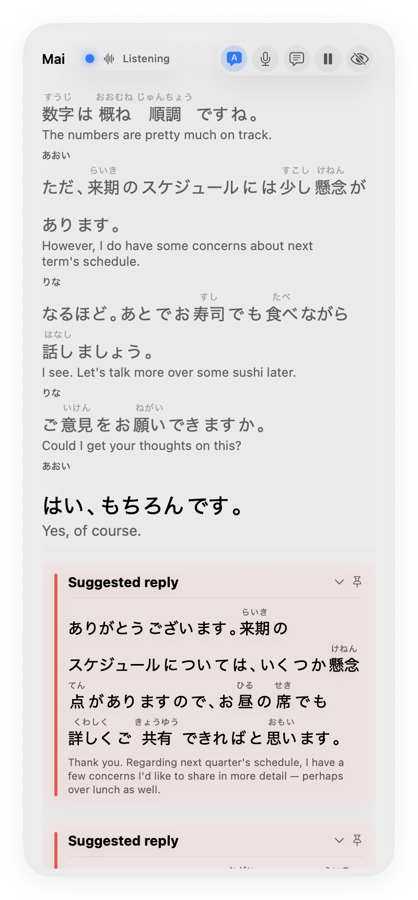
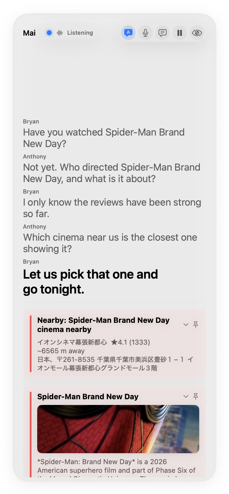
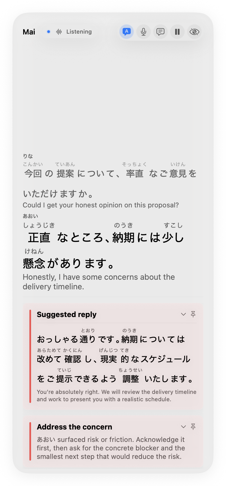
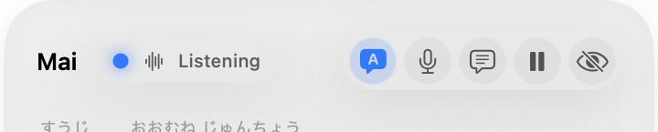

# Mai

Mai is an ambient awareness app for macOS. It listens to your microphone and to the
other side of a call, watches your screen, and quietly surfaces small, sourced cards
while you talk. It reads Japanese and Chinese with furigana and pinyin above the
characters, translates each line as it lands, and can suggest a sentence to say back
in the language the other person is speaking.

Everything runs on your own API keys. Nothing is sent anywhere except to the providers
you configure, and personal details are stripped out before that happens.

**日本語:** Mai は macOS 用の常時待機型アシスタントです。会話をリアルタイムで文字起こしし、漢字にはふりがな、各行には翻訳が付きます。相手の言語のまま返せる一文を提案し、話題に関連する情報カードを静かに表示します。API キーはご自身のものを使い、送信前に個人情報は自動で伏せられます。

**中文:** Mai 是一款 macOS 常驻感知应用。它实时转写对话，为汉字标注拼音并逐行翻译，还能用对方所说的语言给出可直接说出口的回复建议，并安静地推送相关信息卡片。使用你自己的 API 密钥，发送前会自动隐去个人信息。

---

## What it looks like

Mai's resting state is **Mission mode**: a floating panel at the top right that stays
in front of every app, including full-screen calls, without stealing focus. It uses
Liquid Glass on macOS 26 so it reads as a real system surface rather than a window
parked on top of your work, and falls back to standard materials on older systems.

A Japanese conversation, with furigana above the kanji, an English translation under
every line, and a suggested reply you could say back:



Two friends talking about a film. Mai pulls the real poster and summary, and finds the
closest cinema, without either of them asking it anything:



The conversation coach reads the moment and suggests a concrete next move, plus a
sentence you could actually say:



---

## Install

**English.** Download **Mai.dmg** from the
[latest release](https://github.com/antswj/mai/releases/latest), open it, and drag Mai
into your Applications folder. The first time you open it, right-click (or
Control-click) the app and choose **Open**, then confirm. You only need to do that
once; it is because the app is signed but not yet notarized by Apple. After that, open
it normally.

**日本語.** [最新リリース](https://github.com/antswj/mai/releases/latest)から **Mai.dmg**
をダウンロードし、開いて Mai をアプリケーションフォルダにドラッグします。初回のみ、Mai を
右クリック（または Control キーを押しながらクリック）して「開く」を選び、確認してください。
これは Apple の公証がまだ済んでいないためで、次回からは通常どおり開けます。

**中文.** 从[最新版本](https://github.com/antswj/mai/releases/latest)下载 **Mai.dmg**，
打开后把 Mai 拖进「应用程序」文件夹。首次打开时，请右键（或按住 Control 点按）Mai 并选择
「打开」，然后确认。这是因为应用已签名但尚未通过 Apple 公证，之后就可以正常打开了。

---

## How to use Mai

### 1. Get your keys

Mai does not have a server. It uses your own accounts, so you need to paste in a few
keys the first time. Onboarding walks you through it and stores them in the macOS
Keychain, never in a file.

| Key | What it does | Where to get it |
| --- | --- | --- |
| Soniox | Turns speech into text. This is the one Mai really needs. | soniox.com, then add credit |
| Anthropic | Writes the card answers and the suggested replies | console.anthropic.com |
| Gemini | Reads your screen and does web searches with sources | aistudio.google.com |
| Google Places | Finds places nearby | console.cloud.google.com, enable "Places API (New)" |
| Hot Pepper | Restaurants in Japan | webservice.recruit.co.jp |

Each one is free to create. Soniox is pay as you go, so put a little credit on it or
you will get no transcript. Anything you skip just turns off that feature; Mai still
runs.

**日本語.** Mai にはサーバーがありません。ご自身のアカウントを使うため、初回に API キーを
入力します。入力したキーは macOS の Keychain に保存され、ファイルには残りません。文字起こし
には Soniox が必須で、残高がないと文字起こしは行われません。他のキーは省略でき、その機能だけ
がオフになります。

**中文.** Mai 没有服务器，使用的是你自己的账号，因此首次启动时需要填入 API 密钥。密钥保存在
macOS 钥匙串中，不会写入文件。语音转写必须要有 Soniox 并保持余额，否则不会生成文字。其他密钥
可以留空，只会关闭对应功能。

### 2. Give it permission to hear and see

macOS asks twice: once for the **microphone**, once for **screen and system audio
recording**. Say yes to both, then quit Mai and open it again, because macOS only
applies the screen permission after a restart. Without the microphone Mai hears
nothing; without screen recording it cannot hear the other person on a call.

### 3. Talk

That is the whole thing. Mai sits in your menu bar and listens. When something in the
conversation is worth knowing, a card slides in at the top right. When nothing is
happening, it stays out of your way.

### 4. The buttons

Mission mode has five controls along the top:



From left to right:

- **A** turns the translation line under each sentence on and off.
- **Microphone** mutes you. Your own voice stops being transcribed, but the other
  person and your screen keep going. Use this when you step away from a call.
- **Speech bubble** opens a chat box. You can ask "what are they talking about" and
  get an answer based on the real transcript, including what you said.
- **Pause** stops everything. Nothing is captured, transcribed, read, or stored until
  you press it again. This is a real switch, not a mute: it closes the connections.
- **Eye** hides the panel. Mai keeps working; you just stop seeing it. Bring it back
  from the menu bar.

**日本語.** ミッションモードのボタンは左から、翻訳の表示切り替え、マイクのミュート（自分の声
だけ停止し、相手と画面はそのまま）、チャット、一時停止（取得・文字起こし・画面読み取り・保存
をすべて停止）、パネルを隠す、の五つです。

**中文.** 任务模式顶部的五个按钮，从左到右依次是：切换翻译行、静音麦克风（只停用你自己的声音，
对方与屏幕照常）、聊天、暂停（完全停止采集、转写、读屏与保存）、隐藏面板。

### 5. Where the panel goes

Mission mode appears on its own when there is something to show and slides away when
things go quiet. To keep it up, turn on **Keep the HUD pinned open** in Settings. To
summon it instantly from any app, set a **summon shortcut** in Settings.

Open the full window from the menu bar when you want the whole transcript, every card,
notes, and the spend meter. Closing that window returns Mai to the panel.

---

## What it does

- **Live transcript.** Your microphone and the call audio are transcribed separately
  and merged into one conversation, with each person named. Remote speakers get real
  names from the on-screen call tiles when it can work them out.
- **Reading aids.** Furigana above kanji and pinyin above hanzi, rendered properly
  above the characters rather than in brackets after them. Turn on translation and
  each line gets its meaning underneath.
- **Cards.** Sourced answers that appear on their own: local arithmetic, encyclopedia
  entries with real pictures, grounded web answers with links for anything current,
  and plain explanations for technical questions. Nothing is invented; a lookup that
  finds nothing says so.
- **Suggested replies.** A sentence you could say next, in the language being spoken,
  with reading aids and a translation. Off by default.
- **Conversation coaching.** Vocal features (pace, pauses, energy, rough pitch) are
  measured on your Mac and only that summary is sent, never the audio. It suggests a
  move and, when the other person is speaking, something to say. It never claims
  anyone is lying, and that is enforced in code, not just asked for in a prompt.
- **Meeting notes.** Start note-taking, hold the meeting, stop. Mai writes structured
  notes, checks every line against what was actually said, titles it, and saves a Word
  document and a Markdown transcript to a folder you choose.
- **Session transcripts.** Separately from notes, Mai can save a plain transcript when
  a session ends, or on demand. Off by default.
- **Costs stay low.** On-device voice detection opens the transcription stream only
  while somebody is speaking. A spend meter shows the estimated daily cost.

## Privacy

Mai listens continuously, so this part matters.

**Personal details are removed before anything is sent.** Names, emails, phone
numbers, addresses, card numbers, and id numbers are found in each line on your Mac
and swapped for stable placeholders, so a provider sees "Person A" where you see the
real name. The mapping stays in memory on your machine, is never written to disk, and
the real names are put back in everything you see. Because the placeholder is stable
for the session, replies stay just as good. This runs once per line in the background,
so it costs you nothing in speed. It covers text; the audio sent for transcription and
the screen images sent for reading are the raw material itself. Detection is strong,
not perfect. Settings, Privacy has a master switch and per-category controls.

Everything else stays local. Voice detection runs entirely on your Mac, so audio only
leaves while somebody is actually speaking. **Pause** closes the connections outright.
Coaching features are computed on-device and the raw audio is never uploaded. There is
no telemetry and no server. Saved notes and transcripts go only to the folder you
chose. See `SECURITY.md` for the full surface.

## Build it yourself

```
git clone https://github.com/antswj/mai.git
cd mai
cp .env.example .env          # for command line development only
git config core.hooksPath .githooks
./make-app.sh
open Mai.app
```

macOS 15 or later and a Swift 6 toolchain. Command Line Tools are enough; the Liquid
Glass look needs the macOS 26 SDK and falls back to standard materials without it.
`swift run Mai` runs a dev mode with typed input and no capture.

## Configure

`config.toml` is the tuning surface, and every setting has a comment. The ones worth
knowing:

- `[response] enabled` turns suggested replies on, including the coach's.
- `[privacy] redact_before_send` and its per-category switches.
- `[session] save_transcript` writes a transcript every time a session ends.
- `[surfacing] threshold` and `adaptive_quiet` control how chatty the cards are.
- `[providers] llm` picks `anthropic` or `groq`, with model ids under `[models]`.

## Verify

```
swift run MaiTests        # deterministic acceptance harness, no network, exits non-zero on failure
swift test                # the same behaviors as a swift-testing suite (needs full Xcode)
swift run MaiSmoke        # live checks against your real keys, per provider
gitleaks git -v --exit-code 1 .
```

Prompt evals live in `Evals/` and run with promptfoo; see `Evals/README.md`.

## Architecture

- `Sources/MaiCore` is the engine: plain Swift, no UI dependencies. Transcript
  ingestion, triggers, the lookup router, card enrichment with hard timeouts, notes,
  transcripts, coaching, redaction, capture health, and the reading aids.
- `Sources/MaiCapture` is macOS capture: ScreenCaptureKit audio, streaming
  transcription, on-device voice detection, screen watching, vision reads.
- `Sources/MaiApp` is the SwiftUI layer: the floating panel, the full window,
  onboarding, settings, diagnostics.
- `Sources/MaiTests` is the acceptance harness. `Tests/` mirrors it as a
  swift-testing suite. `Evals/` holds the prompt evals.

The screenshots above come from the scripted demos in `docs/`, replayed in the app's
simulated mode. Every name and line in them is fictional.

When Mai shows a place from Hot Pepper, it includes the required credit
"Powered by ホットペッパーグルメ Webサービス".

## License

MIT. See `LICENSE`.
